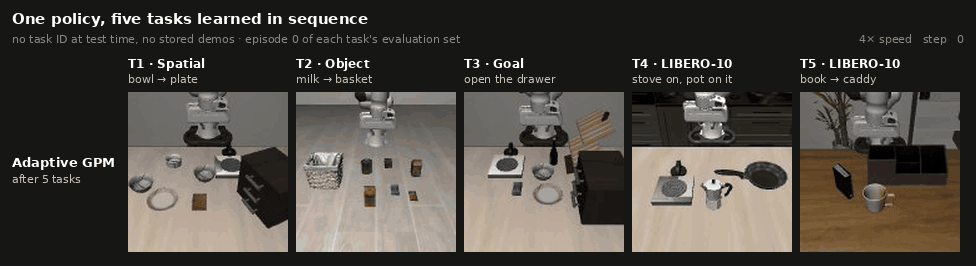
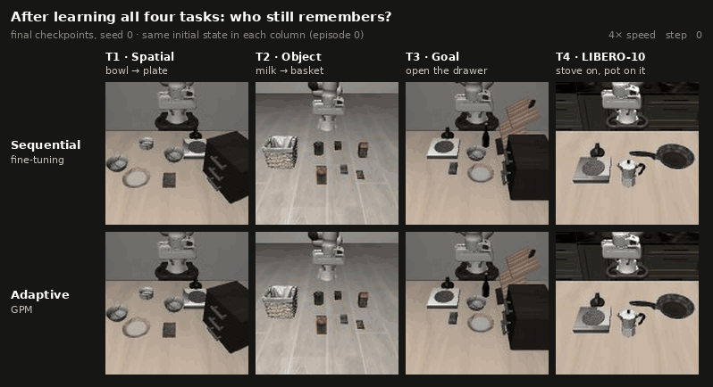
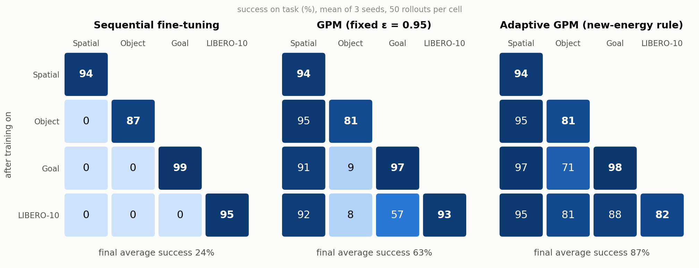
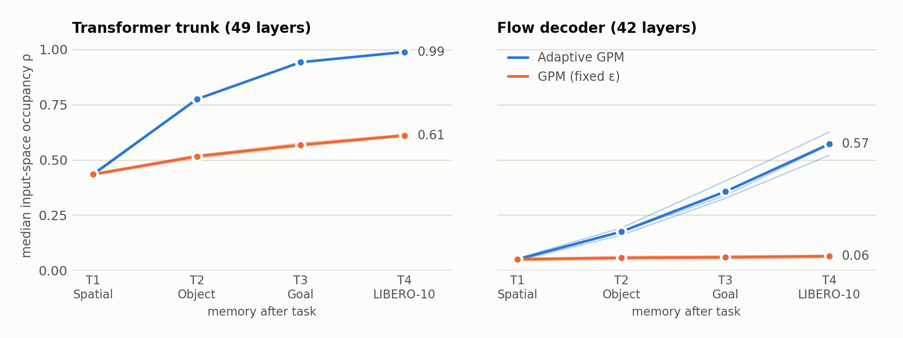
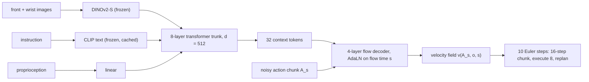

# flowcl: continual learning for flow-matching robot policies

M.Sc. thesis code, in progress. A flow-matching policy with 54M trainable parameters learns LIBERO
manipulation tasks **one after another**. It gets no task ID at test time and stores no old
demonstrations. The project measures how, and where in the network, each new task overwrites the
previous ones. It then tests subspace-protection methods (GPM and variants) against that forgetting.



<sub>**One checkpoint, five tasks.** The adaptive-GPM policy after learning T1 → T5 in that order,
rolled out on each task from episode 0 of the shared evaluation set. Over all 50 evaluation
episodes, this checkpoint succeeds on 90 / 76 / 78 / 74 / 72% of T1–T5. T5 is exploratory
(seed 0 only); the 4-task results below hold on 3 seeds.</sub>

## Main result: forgetting, and what protects against it



<sub>Final checkpoints after Spatial → Object → Goal → LIBERO-10 (seed 0). Both rows start from
the same initial state in each column. Over all 50 evaluation episodes, sequential fine-tuning
succeeds on 0 / 0 / 0 / 98% and adaptive GPM on 98 / 84 / 94 / 92%. Every clip's outcome, here and
above, matches the evaluation's outcome for that episode.</sub>

<picture>
  <source media="(prefers-color-scheme: dark)" srcset="docs/assets/retention_dark.png">
  
</picture>

Row *i*, column *j* is the success rate on task *j* after training on task *i*. Each cell has 50
rollouts from the same fixed initial states for every method, averaged over 3 seeds.

- **Plain sequential fine-tuning forgets everything.** Each earlier task drops to 0% as soon as the
  next one is trained (negative backward transfer 89–95 pp across seeds).
- **GPM (gradient projection memory) keeps the first task but not the later ones.** It stores the
  input subspace of every linear layer and projects new updates off it. With a fixed threshold on
  total energy, only 22–49% of each later task's *new* input energy ends up protected.
- **Adaptive GPM fixes that.** It sets each task's memory target on the energy not already in
  memory: `c = max(0.95, p + 0.9·(1 − p))`, where `p` is the share already covered. The effect has
  the same sign on all three seeds:

| Success after all 4 tasks (%) | seed 0 | seed 1 | seed 2 |
|---|---:|---:|---:|
| Object (task 2) under sequential fine-tuning | 0 | 0 | 0 |
| Object under GPM | 0 | 0 | 24 |
| Object under **adaptive GPM** | **84** | **82** | **78** |
| LIBERO-10 (the newest task) under GPM | 90 | 96 | 94 |
| LIBERO-10 under **adaptive GPM** | 92 | 74 | 80 |

The last two rows show the cost: retention is bought with plasticity.

## The price: the network runs out of free directions

<picture>
  <source media="(prefers-color-scheme: dark)" srcset="docs/assets/capacity_dark.png">
  
</picture>

`ρ` is the fraction of a layer's input space held in protected memory (median over layers; thin
lines are individual seeds).
- **Adaptive protection fills the transformer trunk** to 99% after four tasks.
- **The fifth task in the clip above** was trained under hard projection. It reaches 72% (74%
  unconstrained), at 2.5× the flow-matching probe loss. The older tasks keep eroding (T3 94 → 78%,
  T4 92 → 74%).
- **The open question for the rest of the thesis:** *which* directions actually need protection?

## Negative results, kept in

Each study's decision rule is committed before it runs, so a null result counts as a result.

- **Flow-time-binned protection** (the original novelty idea: one subspace per range of the
  flow-matching time *s*) failed its pre-registered gate over 3 seeds. The gate needed a criterion
  to hold in at least 50% of layers on every seed. Flow time changes *which* decoder directions are
  active (79% of layers), but not *how many* are needed (32%) or how strongly the next task
  interferes (12%). The method was not built.
- **Soft projection (SGP) under AdamW:** the scaled directions consume Adam's step budget. Under
  plain SGD that cost disappears, but SGD underfits (one seed, exploratory).
- **Two-sided (input ⊗ output) protection** was rejected before any training. The trunk's output
  sensitivity is near full rank, so it would free only 7 pp of the trunk.
- **Tuning plain fine-tuning** (lr 1e-5 to 1e-4, 5k to 30k steps) only moves along one
  stability–plasticity frontier. GPM lies beyond it on every seed.

## How it works



- **Policy.** Conditional flow matching over chunks of 7-D actions (end-effector delta + gripper).
  The vision and language encoders stay frozen, so forgetting is confined to the trunk and the
  decoder, the parts under study.
- **Protection.** After each task, forward hooks capture every linear layer's inputs. An SVD of the
  part not already in memory then extends that layer's basis `M`, and the next task's updates are
  projected onto the complement `I − M Mᵀ`.
- **AdamW detail.** Adam's per-coordinate scaling does not preserve subspaces: projecting only the
  gradient left 7–19% of the applied step inside protected directions. The method therefore
  projects twice, the gradient before Adam and the realized weight change after each step
  ([flowcl/methods/gpm.py](flowcl/methods/gpm.py)).

## How the experiments are run

- **Pre-registered.** Every study's decision rule goes in `configs/analysis/<study>.yaml` and is
  committed before its first run. Each outcome, negative ones included, has a record in
  [docs/runs/](docs/runs/).
- **Paired.** Every method is evaluated on the same 50 initial states per task. Rollout seeds derive
  from (run, task, episode). Where two methods must coincide (e.g. adaptive and plain GPM through
  task 2), their checkpoints are compared tensor by tensor: 0 of 656 differ.
- **Traceable.** Each run records its config, git SHA (marked `-dirty` for uncommitted changes),
  `pip freeze` and seeds. Reports pin every input by SHA-256.
- **Tested.** About 700 tests. Every analysis quantity has a synthetic case with a known answer,
  plus a shape and orientation check. (`nn.Linear.weight` is `(d_out, d_in)`, and projecting the
  wrong side silently breaks the method.)
- **Statistics.** Every success rate has a bootstrap CI over rollouts. Main claims are shown per
  seed, with seed 0 for development and seeds 1–2 for replication.

## Quick start

Needs Linux, an NVIDIA GPU (developed on one RTX 4090) and [uv](https://docs.astral.sh/uv/). One
task trains in about 40 min; a 4-task continual run takes about 5.5 h including evaluation.

```bash
git clone --recursive https://github.com/esenoguzhan/flowcl.git && cd flowcl
uv sync      # Python 3.10, torch 2.4.1 (cu121), MuJoCo 2.3.7; see docs/environment_notes.md
uv run python scripts/prepare_libero.py --suites libero_spatial libero_object libero_goal libero_10

# single-task policies + 50-rollout evaluation (Gate 0)
uv run python scripts/gate0.py --curriculum seq_hetero --train-steps 30000 --amp

# the 4-task sequence: plain fine-tuning, GPM, adaptive GPM
uv run python scripts/run_continual.py --curriculum seq_hetero --method seq_ft   --seed 0 --amp
uv run python scripts/run_continual.py --curriculum seq_hetero --method gpm      --seed 0 --amp
uv run python scripts/run_continual.py --curriculum seq_hetero --method gpm_ne90 --seed 0 --amp

# watch a checkpoint on any task it has learned (same initial states as the eval table)
MUJOCO_GL=egl uv run python scripts/record_video.py \
    --checkpoint results/seq_hetero__gpm_projected_adam_ne90__seed0/checkpoints/stage3.pt \
    --task libero_object/pick_up_the_milk_and_place_it_in_the_basket \
    --run-id seq_hetero__seq_ft__seed0 --episodes 0
MUJOCO_GL=egl uv run python scripts/watch.py   # local web viewer

uv run pytest -m "not sim and not gpu"   # CPU-only test subset
```

**Map:**
- [flowcl/models/](flowcl/models/): the policy.
- [flowcl/methods/](flowcl/methods/): the continual-learning methods.
- [flowcl/analysis/](flowcl/analysis/): subspaces, interference, flow-time analysis, metrics.
- [flowcl/experiments/](flowcl/experiments/): one module per study.
- [docs/runs/](docs/runs/): the dated record of every study.
- [docs/thesis_plan.md](docs/thesis_plan.md): the plan.
- [docs/implementation_notes.md](docs/implementation_notes.md): the original implementation spec,
  formerly this README. Records that cite "README §N" refer to its sections.

**Status (October 2026).** Stage A runs in simulation. Next:
- the replay, EWC, LoRA and ConSFT baselines;
- a reverse-order control;
- an 8-task curriculum;
- validation on an AgileX dual-arm robot (Stage B).
